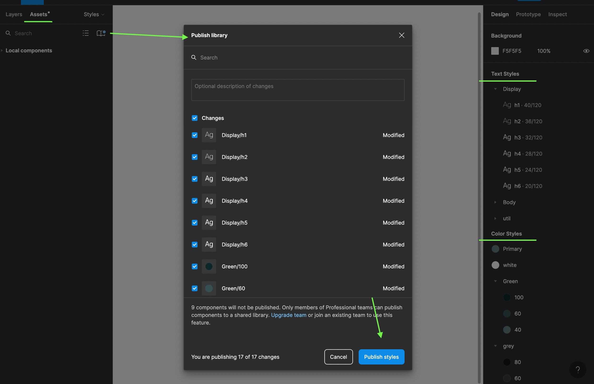

# figma-design-tokens

Use this package to output defined styles in your figma document.

Currently you can select too output __CSS__ (css classes and css-variables) or __typescript files__ to be used with styled-components like Emotion<https://emotion.sh/docs/introduction>. See example of output further below.

- Currently working with __Text styles__, __Color styles__ and __Effects Styles__ from figma.
- Remember to export your styles in figma as a team library.


## How to use

- Add your figma API Token in a environment ".env" file

```.env
    FIGMA_TOKEN=ADD_YOUR_TOKEN_HERE
```

- Create a typescript file and add the following to the file
- Example ./src/design-tokens.ts

```ts
import { GenerateDesignTokens } from 'figma-design-tokens';

new GenerateDesignTokens({
    figmaFileId: 'YOUR_FILE_ID',
    figmaTeamId: 'YOUR_TEAM_ID',
    nodesList: [
        { nodeId: '1:1', lookFor: 'colors' },
        { nodeId: '1:2', lookFor: 'typography' },
        { nodeId: '1:3', lookFor: 'effects' },
        { nodeId: '1:4', lookFor: 'effects' },
    ],
    // Optionals:
    // fileExportType: 'css',
    // distFolder: 'design/tokens',
    // customFluidFontSizeFunction: (fontSize: number) => `${fontSize}rem`,
});
```

- Open terminal and run following command in root folder `npx ts-node src/design-tokens.ts`
- Optional: You could add it under your scripts in package.json. e.g.

```json
"scripts": {
    "get-design-tokens": "ts-node src/design-tokens.ts"
}
```

### Output example

#### __Color ts__ file

Filename: _design-token-effects-1-1-colors.ts_

```ts
/**
 *
 * @example background-color: rgba(12, 39, 42, 1.00);
 */
export const green100 = 'rgba(12, 39, 42, 1.00)';

/**
 *
 * @example background-color: rgba(53, 79, 82, 1.00);
 */
export const green60 = 'rgba(53, 79, 82, 1.00)';
...
```

#### __Color CSS__ file

Filename: _design-token-effects-1-1-colors.css_

```css
:root {
    --green40: rgba(96, 123, 126, 1);

    --green100: rgba(12, 39, 42, 1);

    --green60: rgba(53, 79, 82, 1);
}

...
```

#### __Typography TS__ file

Filename: _design-token-effects-1-2-typography.ts_

```ts
export const displayH1 = {
    fontSize: '40px',
    fontFamily: 'Roboto Flex',
    fontWeight: '100',
    letterSpacing: 'normal',
    lineHeight: '1.2',
    textTransform: 'none',
};

export const bodyBold = {
    fontSize: '16px',
    fontFamily: 'Roboto Flex',
    fontWeight: '600',
    letterSpacing: 'normal',
    lineHeight: '1.375',
    textTransform: 'none',
};
...
```

#### __Typography CSS__ file

Filename: _design-token-effects-1-2-typography.css_

```css
.displayH1 {
    font-family: 'Roboto Flex';
    font-size: 40px;
    font-weight: 100;
    letter-spacing: 0em;
    line-height: 1.2;
    text-transform: none;
}

.bodyBold {
    font-family: 'Roboto Flex';
    font-size: 16px;
    font-weight: 600;
    letter-spacing: 0em;
    line-height: 1.375;
    text-transform: none;
}
...
```

#### __Effects ts__ file

Filename: _design-token-effects-1-3-effects.ts_

```ts
/**
 *
 * @example box-shadow: 0px 3px 14px 4px rgba(0, 0, 0, 0.25);
 */
export const dropshadowLarge = '0px 3px 14px 4px rgba(0, 0, 0, 0.25)';

/**
 *
 * @example box-shadow: 0px 9px 24px 6px rgba(0, 0, 0, 0.12);
 */
export const dropshadowSmall = '0px 9px 24px 6px rgba(0, 0, 0, 0.12)';
...
```

#### __Effects CSS__ file

Filename: _design-token-effects-1-3-effects.css_

```css
:root {
    --dropshadowLarge: 0px 3px 14px 4px rgba(0, 0, 0, 0.25);

    --dropshadowSmall: 0px 9px 24px 6px rgba(0, 0, 0, 0.12);
    ...
}
```

### Typescript interfaces

All typescript interfaces is not entirely accurate. I hope Figma, will add typings them self in the future.

### Prettier VS Code

Remember to add the following to your `.vscode/settings.json` file:

```json
    "prettier.configPath": ".prettierrc.json"
```

### Credits

Big thanks to my former workplace IMPACT COMMERCE <https://impactcommerce.com>, who gave me time to look into this.
